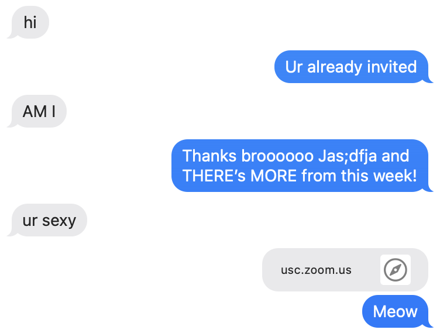

# imessage_bot
Currently stuck in quarentine and am very bored. On my list of morally-gray things to do, I've always wanted to create a chatbot which immitates me for when I'm socially drained.

This bot trains on previous iMessage data. 



## Installaiton 
You need to install...
- `chatterbot`

## Setup
1. Go into `System Preferences` -> `Security` -> `Full Disk Access` and give `Terminal` permissions.
2. Go to `/Users/{your username}/Library/Messages/chat.db` and copy that file into the `imessage_bot` folder. I have .gitignore set to ignore all .db files so you don't have to worry about your personal info getting uploaded to GitHub.

# How to use
Turn on chatbot for specific person.
1. Go into `Training Chat Bot.ipynb`, find index associated with target phone number
2. Create a `config.json` in `imessage_bot` directory 
```
{
  "phone_number" : "+11231231234",
  "db_path" : "/Users/{your}/Library/Messages/chat.db",
  "train_db_path" : "./chat.db",
  "training_phone_number" : null
}
```
If training_phone_number == null, then it'll train on all messages.
If not you can specifiy a contact to train on.

3. Start the bot:
```
python3 main.py
```
Format of phone_number: "+18081231234"

# Improvements
- Find way to clean data
- Use better trainer (probably from `transformers` or `NLTK`)
